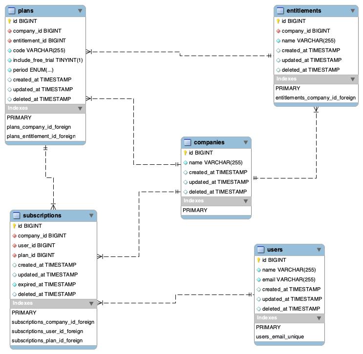

<p align="center">
    
</p>

<h4 align="center">
    Simplestream PHP Code Challenge
</h4>

<hr/>

| Role            	| Mid-Level PHP Developer Role   	|
|-----------------	|--------------------------------	|
| Team            	| Backend (Web) Development Team 	|
| Reports To      	| Head of Software Development   	|
| Time Allocation 	| 2 days                         	|

<hr/>

## Overview

The purpose of this code test is to help us understand your style of coding, technical proficiency and decision-making process.

We are looking at how you approach a problem and how closely you can follow a specification. Remember to show off your ability to write readable code that is maintainable and scalable.

If you struggle with understanding the requirements, please forward your questions to your recruiter, so that we can assist you.

<hr/>

## Requirements


##### **Challenge 1 | Folder: Challenge.01 | time allocated: `45 min`**

We want to know how many users have an active entitlement for each streaming platform/company for a specific period. Here is an example of the CSV report that you will need to create:

| Company 	| Basic 	| Plus  	| Premium 	|
|---------	|-------	|-------	|---------	|
| Amazon  	| 15151 	| 16745 	| 0       	|
| Netflix 	| 0     	| 16254 	| 17115   	|
| YouTube 	| 15940 	| 16770 	| 0       	|

###### Task

For the first code challenge, you will need to create a console command that generates the CSV report.

1. Console command must connect to the database.
2. Console command must accept `start-date` & `end-date` input options.
3. The `start-date` & `end-date` input options are required.
4. Date format must be as follows `YYYY-MM-DD`.
5. Save the CSV file in the `storage` folder.

###### Business rules

1. Users can purchase a monthly or yearly plan. A plan will allocate the user an entitlement which they are allowed to watch certain content.
2. Not all companies have the same entitlements or plans.
3. The console command needs to support additional companies or entitlements without requiring a developer to update the command (**Don't hard code anything**).

###### Resources

We have provided a skeleton console application (using Symfony Components) and a SQL database dump to help you get started. You are welcome to create additional files and add additional packages via composer.

We have included the following packages as well:

- [league/csv](https://csv.thephpleague.com)
- [nesbot/carbon](https://carbon.nesbot.com/)
- [symfony/dotenv](https://symfony.com/components/Dotenv)
- [symfony/var-dumper](https://symfony.com/doc/current/components/var_dumper.html)

**Please note:** We have not set up an IoC Container in the project. 

The console command is located in:
```
Challenge.01/app/Console/Commands/Reports/GenerateUserStatisticsCommand.php
```

To execute the command you can use the following:

```bash
cd Challenge.01

php console generate:users-stats --start-date=2020-01-01 --end-date=2020-12-31
```

Below is the database schema from the SQL database dump.

<p align="center">
    
</p>

###### Tips

We have included [symfony/dotenv](https://symfony.com/components/Dotenv). You can store your database credentials in a DotEnv file. There is an `.env.example` file that you can copy from. We have also provided a `env` helper function to access your environment variables.

```php
$dbHost = env('DB_HOST');
```

##### **Challenge 2 | Folder: Challenge.02 | time allocated: `15 min`**

Part of our legacy code isn't following SOLID principles and becoming difficult to maintain.

###### Task

Please refactor the interfaces into a more sensible architecture. You can add new interfaces where required.

<hr/>

## Submission Rules

1. You will have **two days** to complete the code challenge.
2. Download this repository and create a new repository in your own GitHub account (**Don't Fork this repository!**). Create a new branch for each code challenge (e.g. *feature/challenge-01*, *feature/challenge-02*) and do your changes on those branches. When you are done, please create pull requests for your changes into main (**Without merging!**) so we can review the pull requests.
3. There are many different possible solutions and approaches to implement the required business rules. We are not looking a specific solution but instead are more interested in your approach, how you've implemented your solution and how you structure & format your code.
4. You should try to follow SOLID principles as a general guideline.
5. All code **MUST** be formatted to [PSR12 coding style guidelines](https://www.php-fig.org/psr/psr-12/).
6. Please include docblocks for your methods and comment only where necessary.
7. Once completed, please send your repo url for review.
